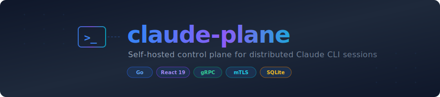
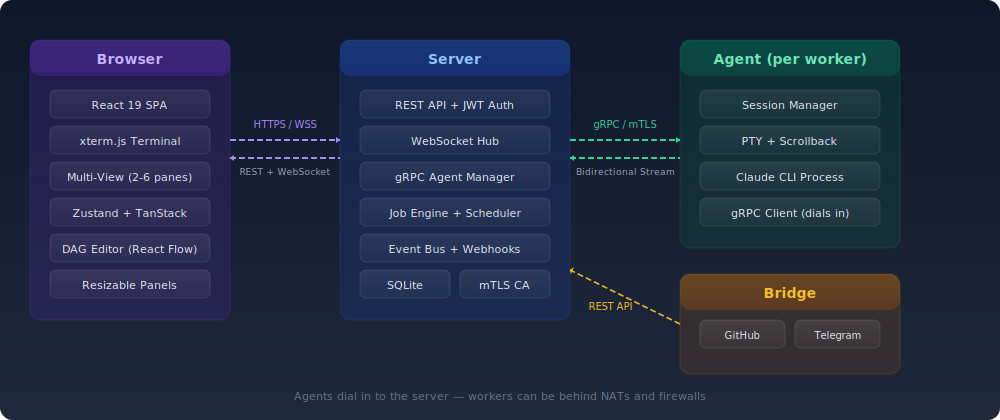

<p align="center">
  
</p>

<p align="center">
  <a href="https://github.com/kodrunhq/claude-plane/actions/workflows/ci.yml"></a>
  <a href="https://go.dev"></a>
  <a href="https://react.dev"></a>
  <a href="https://hub.docker.com/r/jurel89/claude-plane"></a>
  <a href="LICENSE"></a>
</p>

<p align="center">
  A self-hosted control plane for managing interactive <a href="https://docs.anthropic.com/en/docs/claude-code">Claude CLI</a> sessions across distributed machines.<br>
  Run Claude on any number of workers and manage them all from a single web interface.
</p>

---

## Features

- **Remote session management** — Create, monitor, and interact with Claude CLI sessions on any connected machine from your browser
- **Multi-View** — View and interact with 2-6 terminal sessions simultaneously in configurable, resizable split-pane layouts with saved workspaces
- **Persistent sessions** — CLI sessions survive browser disconnects; reconnect and pick up where you left off with full scrollback replay
- **Job system** — Define multi-step jobs as DAGs, trigger runs, and let Claude work across machines with dependency-aware orchestration
- **Real-time terminal** — Full terminal emulation via xterm.js with live WebSocket streaming
- **External integrations** — Bridge component connects GitHub, Telegram, and Slack to trigger jobs and relay notifications
- **Zero-config networking** — Agents dial in to the server, so workers can be behind NATs and firewalls
- **Single binary per role** — No runtime dependencies. `scp` the binary, add a config file, and run
- **mTLS security** — Agent-to-server communication secured with mutual TLS and a built-in CA

## Architecture

<p align="center">
  
</p>

Three components, each a single Go binary:

| Component | Role |
|-----------|------|
| **Server** | Control plane. Serves the React frontend, manages sessions, orchestrates jobs, accepts inbound gRPC connections from agents. SQLite storage. |
| **Agent** | Runs on worker machines. Manages Claude CLI processes in PTYs, buffers terminal output, maintains persistent gRPC connection to the server. |
| **Bridge** | Connects external services (GitHub, Telegram, Slack) to the server via its REST API. |

## Quickstart

### Docker (recommended)

```bash
docker run -d --name claude-plane \
  -p 4200:4200 -p 4201:4201 \
  -v claude-plane-data:/data \
  jurel89/claude-plane:latest
```

That's it. On first run the container automatically generates TLS certificates, creates a config, and seeds an admin account. Check the logs for credentials:

```bash
docker logs claude-plane
```

Default admin: `admin@localhost` / `changeme123`. Customize with environment variables:

```bash
docker run -d --name claude-plane \
  -p 4200:4200 -p 4201:4201 \
  -v claude-plane-data:/data \
  -e ADMIN_EMAIL=me@example.com \
  -e ADMIN_PASSWORD=mysecret \
  jurel89/claude-plane:latest
```

Dashboard at **http://localhost:4200**. Also available on GHCR: `ghcr.io/kodrunhq/claude-plane:latest`

### Build from source

**Prerequisites:** Go 1.25+, Node.js 22+

```bash
# Frontend (output embeds into server binary via go:embed)
cd web && npm install && npm run build && cd ..

# Backend binaries
go build -o claude-plane-server ./cmd/server
go build -o claude-plane-agent ./cmd/agent
go build -o claude-plane-bridge ./cmd/bridge

# Run tests
go test -race ./...
cd web && npm run test -- --run
```

## Documentation

| Guide | Description |
|-------|-------------|
| [Quickstart](docs/quickstart.md) | Single-machine setup for evaluation |
| [Server Installation](docs/install-server.md) | Production server deployment |
| [Agent Installation](docs/install-agent.md) | Worker machine agent setup |
| [Configuration Reference](docs/configuration.md) | All config file options |
| [Architecture](docs/architecture.md) | System design and data flows |

## Contributing

1. Fork the repository
2. Create a feature branch from `main`
3. Run `go test -race ./...` and `cd web && npm run test -- --run` before submitting
4. Open a pull request — CI will run automatically

## License

MIT
